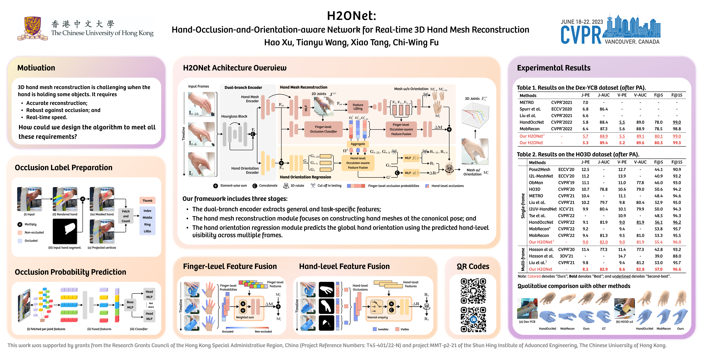

# [CVPR 2023] H2ONet: Hand-Occlusion-and-Orientation-aware Network for Real-time 3D Hand Mesh Reconstruction

<h4 align = "center">Hao Xu<sup>1,2</sup>, Tianyu Wang<sup>1</sup>, Xiao Tang<sup>1</sup>, Chi-Wing Fu<sup>1,2,3</sup></h4>
<h4 align = "center"> <sup>1</sup>Department of Computer Science and Engineering</center></h4>
<h4 align = "center"> <sup>2</sup>Institute of Medical Intelligence and XR, <sup>3</sup>Shun Hing Institute of Advanced Engineering</center></h4>
<h4 align = "center"> The Chinese University of Hong Kong</center></h4>

This is the official implementation of our CVPR2023 paper [H2ONet](https://openaccess.thecvf.com/content/CVPR2023/papers/Xu_H2ONet_Hand-Occlusion-and-Orientation-Aware_Network_for_Real-Time_3D_Hand_Mesh_Reconstruction_CVPR_2023_paper.pdf).

Our presentation video: [[Youtube](https://www.youtube.com/watch?v=JN-G8ePC3Mk)].

## Our Poster



## Install

* Environment
  ```
  conda create -n h2onet python=3.8
  conda activate h2onet
  ```
* Requirements
  ```
  pip install -r requirements.txt
  ```
* Download the pre-trained weights of the backbone `densestack.pth` from Google drive or Baidu cloud, which are both provided by [MobRecon](https://github.com/SeanChenxy/HandMesh). After than, put it into the `checkpoints` folder.

## Data Preparation

We evaluate different models on the DexYCB and HO3D datasets. The pre-processed ground truths are from [HandOccNet](https://github.com/namepllet/HandOccNet). Please follow its instruction to prepare the data and ground truths like this,

```
|-- data  
|   |-- HO3D
|   |   |-- train
|   |   |   |-- ABF10
|   |   |   |-- ......
|   |   |-- evaluation
|   |   |-- annotations
|   |   |   |-- HO3D_train_data.json
|   |   |   |-- HO3D_evaluation_data.json
|   |-- DEX_YCB
|   |   |-- 20200709-subject-01
|   |   |-- ......
|   |   |-- annotations
|   |   |   |--DEX_YCB_s0_train_data.json
|   |   |   |--DEX_YCB_s0_test_data.json
```


## Occlusion Label Preparation

Our single-frame model does not need the occlusion prediction. To train the fingle-level occlusion classifier in our multi-frame model, we first prepare the occlusion label from the provided ground truths. Please find more details in `occ_label_preparation/generate_dexycb_occ.py`.

## Training

For training our single-frame model on the DexYCB dataset,

```
python3 train.py --model_dir=./experiment/experiment_single_dexycb/
```

## Citation

```
@InProceedings{Xu_2023_CVPR,
    author    = {Xu, Hao and Wang, Tianyu and Tang, Xiao and Fu, Chi-Wing},
    title     = {H2ONet: Hand-Occlusion-and-Orientation-Aware Network for Real-Time 3D Hand Mesh Reconstruction},
    booktitle = {Proceedings of the IEEE/CVF Conference on Computer Vision and Pattern Recognition (CVPR)},
    month     = {June},
    year      = {2023},
    pages     = {17048-17058}
}
```

## Acknowledgments

In this project we use (parts of) the official implementations of the following works:

* [MobRecon](https://github.com/SeanChenxy/HandMesh) (Lightweight pipeline)
* [HandOccNet](https://github.com/namepllet/HandOccNet) (HO3D and DexYCB datasets processing)

We thank the respective authors for open sourcing their methods.
